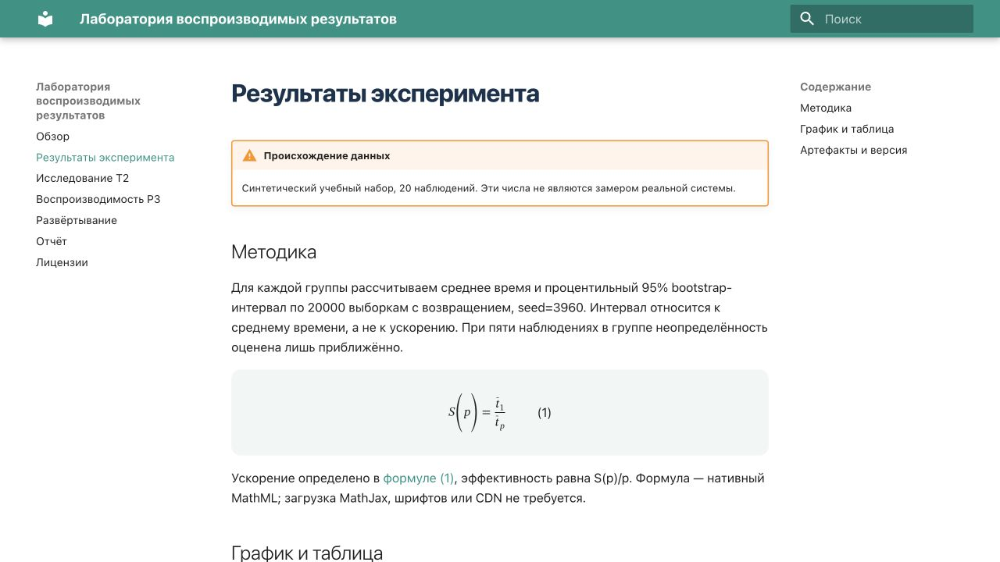
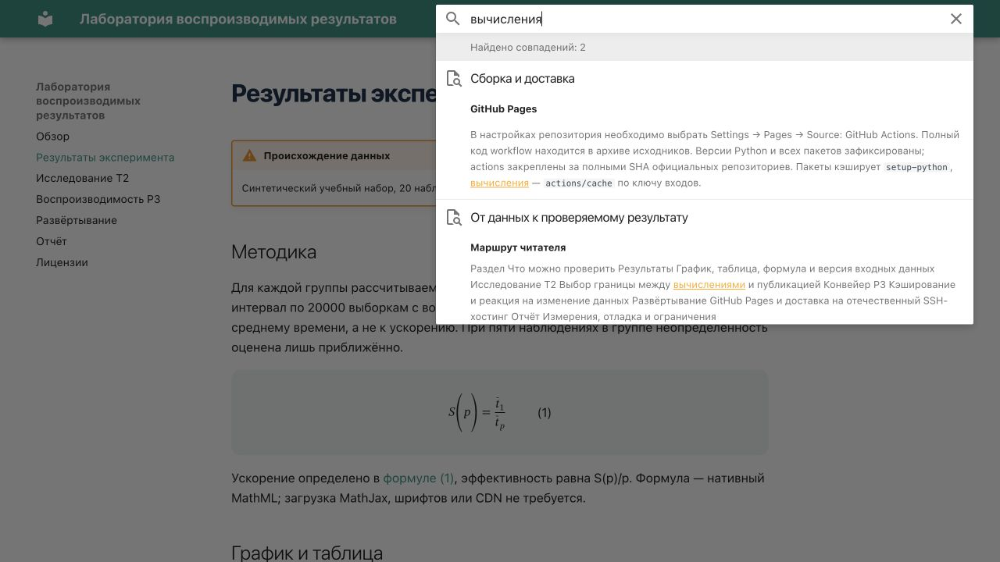
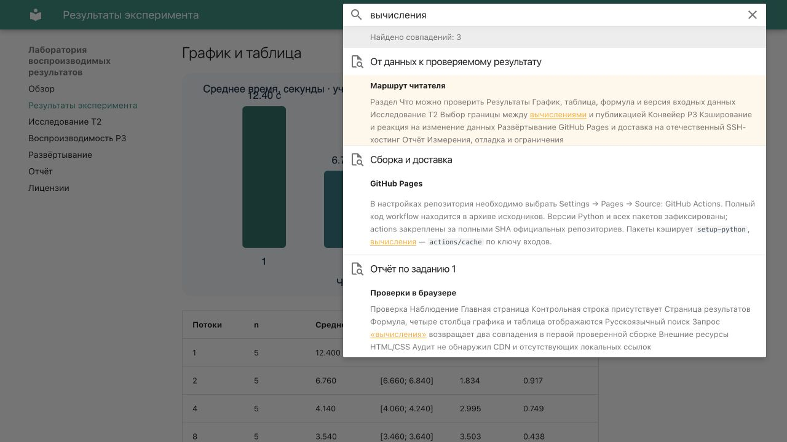

# Отчёт по заданию 1

Автор: Артём Солопов. Выбраны T2 и P3. Основной стек: Python 3.12.13,
MkDocs 1.6.1, Material 9.6.14, стандартная библиотека Python для эксперимента.

## Статус

Реализация собрана и проверена; сайт опубликован на двух площадках:

- [Исходники GitHub](https://github.com/de6igz/python-lab).
- [GitHub Pages](https://de6igz.github.io/python-lab/) — автоматическая доставка Actions.
- [Helios ИТМО](https://se.ifmo.ru/~s332961/python-lab/) — автоматическая доставка SSH/rsync из Actions.

Для обеих площадок подтверждены HTTP 200, контрольная строка, MathML и загрузка
поискового индекса. Русский поиск «вычисления» возвращает три страницы.
Автоматическая доставка на обе площадки подтверждена запуском
[35536497862](https://github.com/de6igz/python-lab/actions/runs/35536497862).
Работа в Moodle пока не отправлена.

## Выполнение основного хода работы

| Пункты задания | Реализация |
| --- | --- |
| 1–3: Python, pip, virtualenv | Python 3.12.13; virtualenv 20.31.2; проверено отдельное окружение с pip 25.1.1 |
| 4: фиксация зависимостей | requirements.txt содержит точные версии всех установленных пакетов; .gitignore исключает кэши и сборки |
| 5–6: каркас и строгая сборка | Material for MkDocs; Makefile запускает эксперимент перед сборкой |
| 7–8: репозиторий и Actions | Публичный репозиторий, Pages и реальные успешные/проваленный запуски Actions |
| 9–10: отечественный хостинг | Автоматическая SSH/rsync-доставка на Helios, ограниченный ключ и HTTP healthcheck |
| 11: базовый URL | SITE_URL для каждой площадки, относительные ссылки, use_directory_urls=false |
| 12: проверка результата | HTTP healthcheck, аудит локальных ссылок/ресурсов, поиск и нативная формула |
| 13: лицензии | MIT для кода, CC BY 4.0 для текста, CC0 для учебного CSV |
| 14: отладка | Три реально запускаемые отрицательные проверки и логи в evidence/ |

## Исследовательская и практическая части

[T2 — сравнение способов исполнения и публикации](research.md) содержит матрицу,
ограничения CI и границу вынесения тяжёлых расчётов. [P3](pipeline.md) реализует
генерацию CSV/SVG/Markdown, кэш по содержимому входов и метки версии.

## Отладка

Ниже — намеренно воспроизведённые ошибки, а не выдуманная история разработки.
Полные stdout/stderr сохранены в `evidence/failure-*.log`.

| Ошибка | Гипотеза | Проверка | Решение |
| --- | --- | --- | --- |
| `ValueError: workers/run must be positive; seconds must be finite and positive` | Во входе отрицательное время | Запуск скрипта с seconds=-1 | Отбраковка входа до расчёта; восстановление положительного времени |
| Strict build: ссылка на `absent.md` | Документ отсутствует | Отдельная тестовая сборка с битой ссылкой | Ссылка заменена на существующий заголовок |
| Strict build: якорь `#absent` | Несовпадение идентификатора раздела | Сборка с включённым validation.links.anchors=warn | Ссылка заменена на `#test`; повторная строгая сборка успешна |

Дополнительно проверяется повреждение кэшированного JSON: несовпадение хеша
приводит к пересчёту, а не публикации повреждённого результата.

## Вывод

Для небольших воспроизводимых CPU-экспериментов рекомендуется Python → CSV/SVG/Markdown
→ MkDocs Material → CI → статический хостинг. Это сокращает число зависимостей
и делает связь входов с результатом явной. Для книги со сложными перекрёстными
ссылками и ноутбуками предпочтительнее Sphinx/MyST-NB или Quarto; тяжёлые GPU-расчёты
нужно выполнять отдельно, публикуя проверяемые артефакты. Вывод относится к учебной
публикации; синтетические данные не дают научного вывода о реальном оборудовании.

## Измерения

Машина: macOS-26.6.2-arm64-arm-64bit, Python 3.12.13. Время — wall-clock через
`time.perf_counter`, включая запуск процесса. Пять парных запусков эксперимента
с пустым и заполненным кэшем; три независимых `mkdocs build --strict`.
Это локальные замеры, а не время GitHub runner.

| Показатель | Значение | Метод |
| --- | --- | --- |
| Расчёт без кэша, медиана | 0.370384 с | 5 запусков, удаление только тестового кэша |
| Расчёт с кэшем, медиана | 0.058992 с | 5 повторных запусков с теми же входами |
| Отношение медиан | 6.28 раза | без искусственных задержек |
| Строгая сборка MkDocs, медиана | 0.455489 с | 3 запуска, уже сгенерированные страницы |
| HTML страницы результатов | 18086 байт | без сжатия |
| Измеренная сборка целиком | 3000775 байт | со скриншотами; сумма файлов перед финальной редактурой отчёта |
| Pages: deploy-pages | 9 с / 11 с | первая публикация / обновление CSV; время job по API Actions |
| Helios: deploy-helios | 14 с | автоматическая job 35536497862, включая checkout, artifact и healthcheck |
| Pages: deploy-pages в том же запуске | 8 с | доставка через официальный Pages artifact |

Исходные ряды: `evidence/measurements.csv`; сводка: `evidence/summary.json`.

## Изменение данных и кэш

В коммите `599eb1c3045b84c69ac28e0a581cdded8ccefe15` в исходном CSV изменено
время для workers=8, run=1: 3.5 → 2.5 с. После push среднее на GitHub Pages
изменилось с 3.540 до 3.340 с; изменились SHA-256 данных, ключ кэша и SVG.
Снимки удалённых ответов: `evidence/pages-before.json` и `evidence/pages-after.json`.
Та же версия данных опубликована вручную на Helios (`evidence/helios-published.json`).

Отдельный повторяемый тест `scripts/verify.py` прибавляет 1 с к последней записи
изолированной копии CSV и проверяет пересчёт. Он работает и после обновления
основного набора. Неизменные входы используют кэш; повреждённый JSON пересчитывается.
Результаты этого теста: `evidence/data-change.json`.

## Реальные запуски GitHub Actions

| Запуск | Результат | Стадии |
| --- | --- | --- |
| [35435796768](https://github.com/de6igz/python-lab/actions/runs/35435796768) | Успех, исходная публикация | check 27 с; build 21 с; deploy-pages 9 с |
| [35436124108](https://github.com/de6igz/python-lab/actions/runs/35436124108) | Ожидаемый сбой | `does-not-exist.md`: strict build завершился с кодом 1; доставка пропущена |
| [35436253645](https://github.com/de6igz/python-lab/actions/runs/35436253645) | Успех после изменения CSV | check 23 с; build 30 с; deploy-pages 11 с |

Полные логи: `evidence/ci-initial-build.log`, `evidence/ci-intentional-failure.log`.
Метаданные времени стадий: `evidence/ci-initial-jobs.json`,
`evidence/ci-data-change-jobs.json`. Скриншот успешного CI сохранён локально
в `evidence/ci-success.png`. Скриншот неуспешного запуска пока не получен:
страница GitHub в браузере отвечает ERR_TIMED_OUT, результат подтверждён API и логом.
SSH-секреты настроены; в `evidence/ci-helios-deploy.log` значения `DEPLOY_KEY`
и `KNOWN_HOSTS` замаскированы (`***`). Ключ допускает только rrsync-запись в
каталог сайта, запрещает удаление и shell-команды; host key проверяется строго.

## Автоматическая доставка на Helios

[Запуск 35536497862](https://github.com/de6igz/python-lab/actions/runs/35536497862)
завершился успешно: check — 20 с, build — 24 с, deploy-helios — 14 с,
deploy-pages — 8 с. Метаданные: `evidence/ci-helios-jobs.json`.
На обеих площадках HTTP 200, контрольная строка и коммит
`6c1b950e64bd652210eac91f8a36e14f327cf590`, `dirty=false`;
доказательства — `evidence/automatic-publication.json`.

Первый ручной запуск 35536242989 пропустил Helios: условие включения не увидело
переменные. Адрес, порт, пользователь, каталог и URL закреплены в workflow как
несекретные значения по умолчанию. Variables могут их переопределить;
`HELIOS_ENABLED=false` явно отключает доставку. Ключи хранятся только в Secrets.

## Проверки в браузере

| Проверка | Наблюдение |
| --- | --- |
| Главная страница | Контрольная строка присутствует |
| Страница результатов | Формула, четыре столбца графика и таблица отображаются |
| Русскоязычный поиск | Запрос «вычисления» возвращает два совпадения в первой проверенной сборке |
| Внешние ресурсы HTML/CSS | Аудит не обнаружил CDN и отсутствующих локальных ссылок |

Скриншоты относятся к локальному предпросмотру, не к удалённому CI.

## Проверка без внешних CDN и в подкаталоге

Итоговая сборка обслуживалась по `/site/` локальным сервером с CSP, разрешающим
ресурсы только с того же origin. Фактический заголовок и HTTP 200 с контрольной
строкой сохранены в `evidence/http-csp.json`. В этой конфигурации формула и график
отображаются, поиск «вычисления» возвращает три страницы (в индекс вошёл отчёт).
В консоли браузера предупреждений и ошибок не обнаружено.

Для формул дополнительные JS-ресурсы не загружаются: нативный MathML добавляет
только разметку в HTML. Подключение собственного MathJax здесь не требуется.

## Учебные материалы

Прочитаны условие задания и раздел «Практика 1» курса, в том числе описание
`public_html` и URL пользовательского сайта Helios. Ссылка на Яндекс Диск ведёт
к видео «0. Публикация на GitHub Pages на основе Hugo + Jekyll.webm».
Видеоматериал не использовался как доказательство выполненных действий;
реализация и исследование опираются на ТЗ, фактические проверки и официальную
документацию, указанную в T2.
