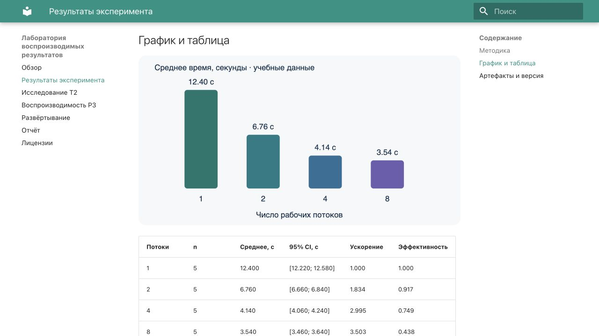

# Отчёт по заданию 1

Автор: Артём Солопов. Выбраны T2 и P3. Основной стек: Python 3.12.13,
MkDocs 1.6.1, Material 9.6.14, стандартная библиотека Python для эксперимента.

## Статус

Локальная реализация собрана и проверена. Строгая сборка, тесты,
проверка кэша, обновление CSV/SVG и аудит локальных ссылок прошли успешно. Публикация в GitHub и на отечественном хостинге отложена
по решению автора; ссылки, remote run и скриншоты внешнего CI пока отсутствуют.

## Выполнение основного хода работы

| Пункты задания | Реализация |
| --- | --- |
| 1–3: Python, pip, virtualenv | Python 3.12.13; virtualenv 20.31.2; проверено отдельное окружение с pip 25.1.1 |
| 4: фиксация зависимостей | requirements.txt содержит точные версии всех установленных пакетов; .gitignore исключает кэши и сборки |
| 5–6: каркас и строгая сборка | Material for MkDocs; Makefile запускает эксперимент перед сборкой |
| 7–8: репозиторий и Actions | Локальный Git уже инициализирован; workflow подготовлен; удалённая публикация ожидает следующего этапа |
| 9–10: отечественный хостинг | Подготовлен SSH/rsync-скрипт и выключенная до настройки job |
| 11: базовый URL | SITE_URL для каждой площадки, относительные ссылки, use_directory_urls=false |
| 12: проверка результата | HTTP healthcheck, аудит локальных ссылок/ресурсов, поиск и нативная формула |
| 13: лицензии | MIT для кода, CC BY 4.0 для текста, CC0 для учебного CSV |
| 14: отладка | Три реально запускаемые отрицательные проверки и логи в evidence/ |

## Исследовательская и практическая части

[T2 — сравнение способов исполнения и публикации](research.md) содержит матрицу,
ограничения CI и границу вынесения тяжёлых расчётов. [P3](pipeline.md) реализует
генерацию CSV/SVG/Markdown, кэш по содержимому входов и метки версии.

## Отладка

Ниже — намеренно воспроизведённые ошибки, а не выдуманная история разработки.
Полные stdout/stderr сохранены в `evidence/failure-*.log`.

| Ошибка | Гипотеза | Проверка | Решение |
| --- | --- | --- | --- |
| `ValueError: workers/run must be positive; seconds must be finite and positive` | Во входе отрицательное время | Запуск скрипта с seconds=-1 | Отбраковка входа до расчёта; восстановление положительного времени |
| Strict build: ссылка на `absent.md` | Документ отсутствует | Отдельная тестовая сборка с битой ссылкой | Ссылка заменена на существующий заголовок |
| Strict build: якорь `#absent` | Несовпадение идентификатора раздела | Сборка с включённым validation.links.anchors=warn | Ссылка заменена на `#test`; повторная строгая сборка успешна |

Дополнительно проверяется повреждение кэшированного JSON: несовпадение хеша
приводит к пересчёту, а не публикации повреждённого результата.

## Вывод

Для небольших воспроизводимых CPU-экспериментов рекомендуется Python → CSV/SVG/Markdown
→ MkDocs Material → CI → статический хостинг. Это сокращает число зависимостей
и делает связь входов с результатом явной. Для книги со сложными перекрёстными
ссылками и ноутбуками предпочтительнее Sphinx/MyST-NB или Quarto; тяжёлые GPU-расчёты
нужно выполнять отдельно, публикуя проверяемые артефакты. Вывод относится к учебной
публикации; синтетические данные не дают научного вывода о реальном оборудовании.

## Измерения

Машина: macOS-26.6.2-arm64-arm-64bit, Python 3.12.13. Время — wall-clock через
`time.perf_counter`, включая запуск процесса. Пять парных запусков эксперимента
с пустым и заполненным кэшем; три независимых `mkdocs build --strict`.
Это локальные замеры, а не время GitHub runner.

| Показатель | Значение | Метод |
| --- | --- | --- |
| Расчёт без кэша, медиана | 0.373798 с | 5 запусков, удаление только тестового кэша |
| Расчёт с кэшем, медиана | 0.061771 с | 5 повторных запусков с теми же входами |
| Отношение медиан | 6.05 раза | без искусственных задержек |
| Строгая сборка MkDocs, медиана | 0.480051 с | 3 запуска, уже сгенерированные страницы |
| HTML страницы результатов | 18057 байт | без сжатия |
| Измеренная сборка целиком | 3001419 байт | со скриншотами; сумма файлов перед финальной редактурой отчёта |
| Удалённая доставка Pages / Helios | Не измерена | публикация отложена |

Исходные ряды: `evidence/measurements.csv`; сводка: `evidence/summary.json`.

## Изменение данных и кэш

В копии CSV изменено время для workers=8, run=1: 3.5 → 2.5 с. Среднее в группе
изменилось с 3.540 до 3.340 с; ключ кэша и SVG изменились. Повторный запуск с
неизменными входами использует кэш. Повреждённый JSON пересчитывается. Подробности
до/после сохранены в `evidence/data-change.json`. Оригинал набора не изменён.

## Проверки в браузере

| Проверка | Наблюдение |
| --- | --- |
| Главная страница | Контрольная строка присутствует |
| Страница результатов | Формула, четыре столбца графика и таблица отображаются |
| Русскоязычный поиск | Запрос «вычисления» возвращает два совпадения в первой проверенной сборке |
| Внешние ресурсы HTML/CSS | Аудит не обнаружил CDN и отсутствующих локальных ссылок |

Скриншот сохранён в локальном архиве; публичная загрузка ожидает подтверждения.

Скриншот сохранён в локальном архиве; публичная загрузка ожидает подтверждения.

Скриншоты относятся к локальному предпросмотру, не к удалённому CI.

## Проверка без внешних CDN и в подкаталоге

Итоговая сборка обслуживалась по `/site/` локальным сервером с CSP, разрешающим
ресурсы только с того же origin. Фактический заголовок и HTTP 200 с контрольной
строкой сохранены в `evidence/http-csp.json`. В этой конфигурации формула и график
отображаются, поиск «вычисления» возвращает три страницы (в индекс вошёл отчёт).
В консоли браузера предупреждений и ошибок не обнаружено.

Скриншот сохранён в локальном архиве; публичная загрузка ожидает подтверждения.

Для формул дополнительные JS-ресурсы не загружаются: нативный MathML добавляет
только разметку в HTML. Подключение собственного MathJax здесь не требуется.

## Учебные материалы

Прочитаны условие задания и раздел «Практика 1» курса, в том числе описание
`public_html` и URL пользовательского сайта Helios. Ссылка на Яндекс Диск ведёт
к видео «0. Публикация на GitHub Pages на основе Hugo + Jekyll.webm».
Видеоматериал не использовался как доказательство выполненных действий;
реализация и исследование опираются на ТЗ, фактические проверки и официальную
документацию, указанную в T2.
